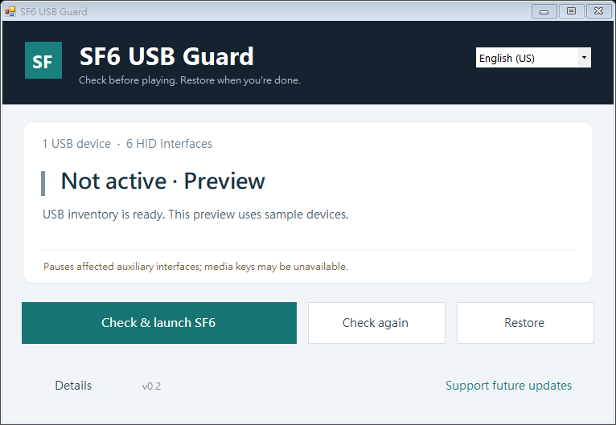

# Fix Street Fighter 6 Freezing When a USB Device Disconnects

Street Fighter 6 USB Disconnect Freeze Fix | SF6 Mouse & Controller Freeze

[繁體中文](README.zh-TW.md)

If Street Fighter 6 freezes when a USB device disconnects or your wireless mouse goes to sleep, but the audio keeps playing, try **SF6 USB Guard**.

[Download for Windows](https://github.com/TANANIS/SF6-USB-Guard/releases/download/v0.2.0/SF6-USB-Guard-v0.2.zip) · [Usage guide](USAGE.md)

1. Extract the ZIP and close SF6.
2. Open **SF6-USB-Guard.exe**.
3. Click **Check & launch SF6**. The app checks your devices, applies protection where needed, and launches the game.

English and Traditional Chinese are available in the top-right menu.

[Support updates](https://buymeacoffee.com/tananis)
