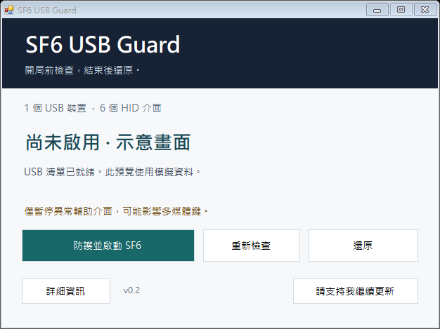

# Fix Street Fighter 6 Freezing When a USB Device Disconnects

Street Fighter 6 USB Disconnect Freeze Fix | SF6 Mouse & Controller Freeze

[繁體中文](README.zh-TW.md)

If Street Fighter 6 freezes when a USB device disconnects or your wireless mouse goes to sleep, but the audio keeps playing, try **SF6 USB Guard**.

[Download ZIP](https://github.com/TANANIS/SF6-USB-Guard/archive/refs/heads/main.zip) · [Usage guide / 使用說明](使用說明.md)

1. Extract the ZIP and close SF6.
2. Open **SF6-USB-Guard.exe**.
3. Click **防護並啟動 SF6** to check your devices and apply protection before launching the game.

[Support updates](https://buymeacoffee.com/tananis)
